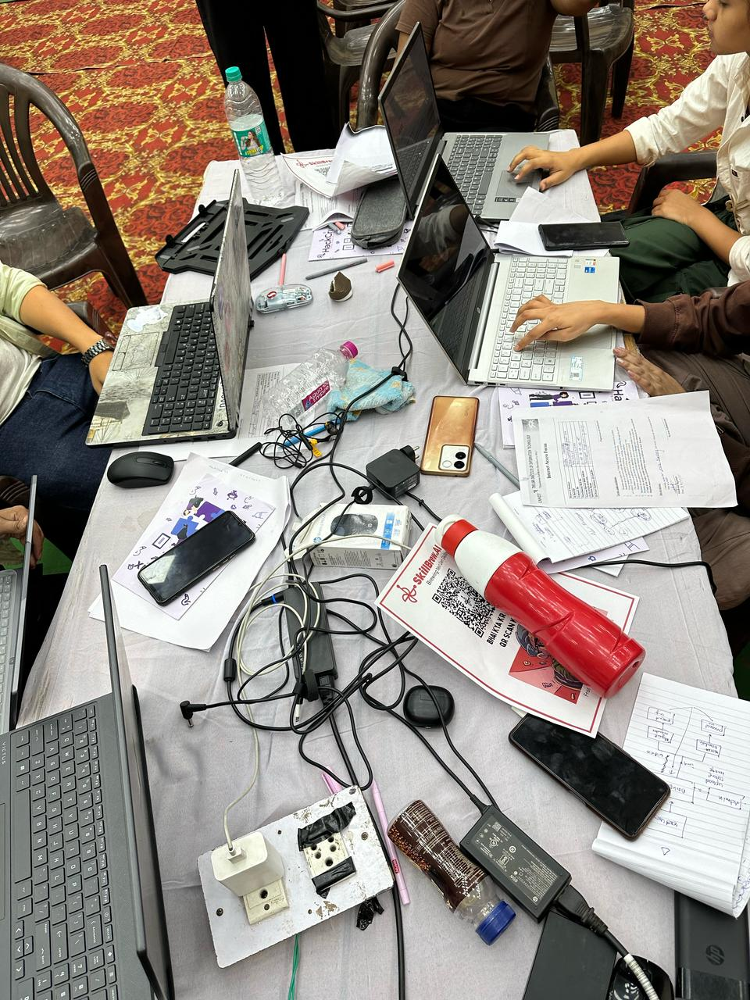
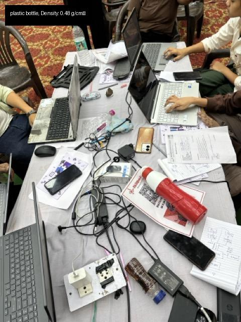

# ♻️ GreenTech - Smart Waste Detection Platform

> 🌍 AI-powered platform to classify waste and promote sustainable disposal.

---

## 🚀 Features

- 🤖 **AI-Based Waste Detection** – Automatically detects and classifies waste from uploaded or captured images.
- 📷 **Image Upload & Camera Input** – Simple interface to upload or capture waste images.

---

## 🧰 Tech Stack

| Technology | Purpose |
|------------|---------|
| **Python** | Core programming language |
| **TensorFlow / PyTorch** | AI/ML model for waste classification |
| **Flask / FastAPI** | Backend API |
| **React / HTML / CSS / JS** | Frontend development |
| **OpenCV / PIL** | Image processing |

---

## 🧠 How It Works

1. **User uploads or captures an image** of waste through the UI.
2. 📥 The image is sent to the backend server.
3. 🧠 The AI model classifies the waste (e.g., plastic, organic, metal,e-waste).
4. comming soon : 🗑️ Based on the classification, disposal guidelines are shown.
5. coming soon: Displays **nearby waste facilities** for user convenience.

---

## 🏗️ Project Structure

```
├── tailwind.config.ts
├── index.html
├── package.json
├── vite.config.ts
├── .gitignore

│── src/
│   ├── components/
│   │   ├── AIWasteDetector.tsx
│   │   ├── FeatureCard.tsx
│   │   ├── Footer.tsx
│   │   ├── Hero.tsx
│   │   ├── Navbar.tsx
│   │   ├── PageTransition.tsx
│   ├── hooks/
│   │   ├── use-mobile.tsx
│   │   ├── use-toast.ts
│   ├── lib/
│   │   ├── utils.ts
│   ├── pages/
│   │   ├── About.tsx
│   │   ├── Contact.tsx
│   │   ├── Feature.tsx
│   │   ├── Index.tsx
│   │   ├── NotFound.tsx

│── public/
│   ├── favicon.ico
│   ├── placeholder.svg
│   ├── robots.txt

│── backend/
│   ├── app.py        # Flask backend
│   ├── model.py      # AI model
```

---

## 📡 API Reference

### 📋 Key Parameters

| Parameter | Type | Description |
|----------|------|-------------|
| `PIL.Image` | Image Object | For loading and preprocessing waste images |
| `NumPy Array` | ndarray | Used to convert images into numerical format |
| `LABELS` | List[str] | Categories like `["Plastic", "E-waste", "Organic", "Paper", "Hazardous", "General Waste"]` |
| `random.choice` | Function | Used to simulate predictions (for demo/testing) |
| `Flask API` | API Framework | Handles image uploads and AI predictions |
| `Model.predict()` | Function | Predicts waste category from image |
| `Dataset` | TACO / WasteNet (optional) | Used for training the AI model |

---

## 🛠️ Tech Stack

- **Frontend:** React, Vite, TailwindCSS  
- **Backend:** Python, Flask  
- **Machine Learning:** TensorFlow / Keras *(or PyTorch)*  
- **Libraries:** OpenCV, NumPy, Pillow (PIL)  

---

## 🖥️ Installation & Setup

```bash
# 1. Clone the repository
git clone https://github.com/SnehaChouksey/GreenTech.git
cd GreenTech

# 2. Create and activate a virtual environment
python -m venv venv
source venv/bin/activate  # Windows: venv\Scripts\activate

# 3. Install backend dependencies
pip install -r requirements.txt

# 4. Run the backend server
python backend/app.py  # Or use FastAPI: uvicorn backend.main:app --reload

# 5. Start the frontend (React)
cd frontend
npm install
npm start
```

---

## 📸 Demo

### 🖼️ Uploaded Image

This is the image submitted by the user for waste classification:



---

### 🧐 AI-Detected Output

The AI model identifies the waste type and calculates its density:



## 🤝 Contributing

We welcome contributions! 🚀

1. Fork the repository
2. Create a new branch (`git checkout -b feature-name`)
3. Make your changes
4. Commit and push (`git commit -m 'Add feature'`)
5. Submit a pull request

Please read [CONTRIBUTING.md](CONTRIBUTING.md) for full guidelines (coming soon).

---

## 📜 License

This project is licensed under the **MIT License**.  
See [LICENSE](LICENSE) file for more details.

---

## 📬 Contact

**Maintainer:** Sneha Chouksey  
📧 Email: [snehachouksey@example.com](mailto:snehachouksey@example.com)  
🔗 GitHub: [@SnehaChouksey](https://github.com/SnehaChouksey)

---

> 💡 *GreenTech is a step towards a cleaner, smarter, and more sustainable future.*


## Project info

**URL**: https://lovable.dev/projects/035ac17e-244b-4dd7-b92e-fa73ad64cc05

## How can I edit this code?

There are several ways of editing your application.

**Use Lovable**

Simply visit the [Lovable Project](https://lovable.dev/projects/035ac17e-244b-4dd7-b92e-fa73ad64cc05) and start prompting.

Changes made via Lovable will be committed automatically to this repo.

**Use your preferred IDE**

If you want to work locally using your own IDE, you can clone this repo and push changes. Pushed changes will also be reflected in Lovable.

The only requirement is having Node.js & npm installed - [install with nvm](https://github.com/nvm-sh/nvm#installing-and-updating)

Follow these steps:

```sh
# Step 1: Clone the repository using the project's Git URL.
git clone <YOUR_GIT_URL>

# Step 2: Navigate to the project directory.
cd <YOUR_PROJECT_NAME>

# Step 3: Install the necessary dependencies.
npm i

# Step 4: Start the development server with auto-reloading and an instant preview.
npm run dev
```


## How can I deploy this project?
to deploy this project run 
```sh
 npm run deploy
```
  or
Simply open [Lovable](https://lovable.dev/projects/035ac17e-244b-4dd7-b92e-fa73ad64cc05) and click on Share -> Publish.

## I want to use a custom domain - is that possible?

We don't support custom domains (yet). If you want to deploy your project under your own domain then we recommend using Netlify. Visit our docs for more details: [Custom domains](https://docs.lovable.dev/tips-tricks/custom-domain/)
